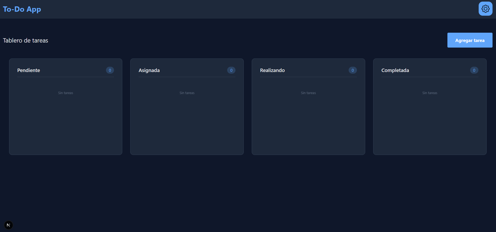
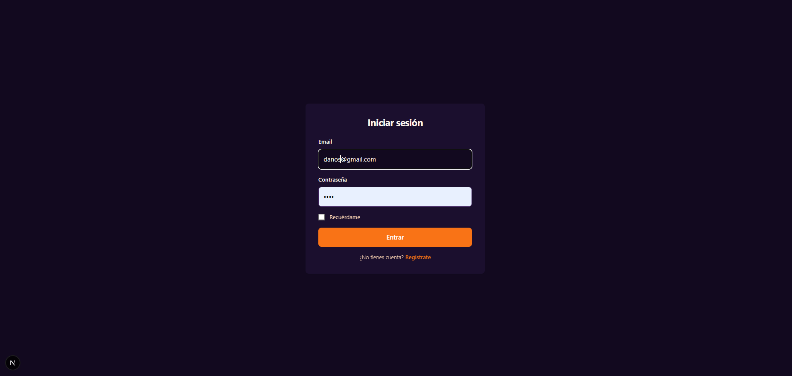
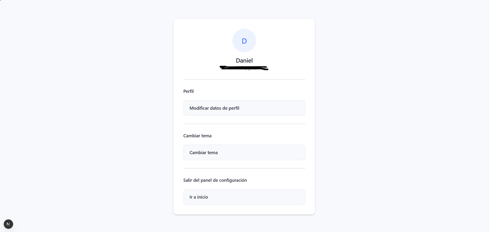

# ToDo App - Documentación Técnica

## 1. Flujo de Datos del Sistema de Autenticación

### 1.1 Diagrama de Flujo

```
┌─────────────┐     ┌─────────────┐     ┌─────────────┐     ┌─────────────┐
│   Frontend  │────▶│   GraphQL   │────▶│   Resolver  │────▶│   Service   │
│   (Next.js) │     │     API     │     │  (NestJS)   │     │             │
└─────────────┘     └─────────────┘     └─────────────┘     └─────────────┘
       │                   │                   │                   │
       │ Mutation          │ Query/Mutation    │ Lógica de         │
       │ Login/Register    │ validate          │ negocio           │
       │                   │                   │                   │
       ▼                   ▼                   ▼                   ▼
┌─────────────┐     ┌─────────────┐     ┌─────────────┐     ┌─────────────┐
│  Interfaz   │     │   Schema    │     │ AuthService │     │   TypeORM   │
│   Usuario   │     │   Types     │     │             │     │  Repository │
└─────────────┘     └─────────────┘     └─────────────┘     └─────────────┘
```

### 1.2 Flujo de Registro (Register)

```
1. Usuario completa formulario (email, password, fullName, gender)
         │
         ▼
2. Frontend: mutation register → GraphQL API
         │
         ▼
3. AuthResolver: recibe CreateUserDto
         │
         ▼
4. AuthService.registerUser():
   a) Verifica si email ya existe (busca con soft delete)
   b) Si existe → throw BadRequestException
   c) Si no existe → hashPassword(body.password)
   d) Guardar usuario en DB
   e) Generar JWT con payload { email }
         │
         ▼
5. AuthCookiesService.setTokenCookie() → establece cookie "token"
         │
         ▼
6. Retorna { email } al frontend
```

### 1.3 Flujo de Login

```
1. Usuario ingresa email y password
         │
         ▼
2. Frontend: mutation login → GraphQL API
         │
         ▼
3. AuthResolver: recibe LoginDto
         │
         ▼
4. AuthService.loginUser():
   a) Buscar usuario por email (deletedAt: null)
   b) Si no existe → throw BadRequestException
   c) Verificar contraseña con verifyHashPassword()
   d) Si no coincide → throw BadRequestException
   e) Generar JWT con payload { email }
         │
         ▼
5. AuthCookiesService.setTokenCookie() → establece cookie "token"
         │
         ▼
6. Retorna { email, token } al frontend
```

### 1.4 Flujo de Verificación (Verification)

```
1. App carga → consulta verification query
         │
         ▼
2. Frontend: query verification → GraphQL API
         │
         ▼
3. AuthResolver.verification():
   a) Extrae cookies del request
   b) AuthCookiesService.verifyTokenFromCookie()
   c) Decodifica JWT
   d) Busca usuario en DB
   e) Genera nuevo JWT (refresh)
   f) Actualiza cookie
         │
         ▼
7. Retorna { email, message }
```

### 1.5 Protección de Rutas

- **AuthGuard**: Verifica que el token JWT sea válido
- Las queries/mutations de Tasks solo son accesibles con token válido
- El token se envía en cookies (httponly, secure)

---

## 2. Modelo de Datos (UML)

### 2.1 Diagrama de Entidades

```
┌─────────────────────────────────────────────────────────────┐
│                          User                               │
├─────────────────────────────────────────────────────────────┤
│ - id: string (PK)                                          │
│ - email: string (unique)                                   │
│ - password: string                                         │
│ - fullName: string                                         │
│ - gender: gender                                           │
│ - deletedAt: Date | null (soft delete)                     │
├─────────────────────────────────────────────────────────────┤
│ + tasks: Task[] (OneToMany)                                │
└─────────────────────────────────────────────────────────────┘
                              │
                              │ 1:N
                              ▼
┌─────────────────────────────────────────────────────────────┐
│                          Task                               │
├─────────────────────────────────────────────────────────────┤
│ - id: string (PK)                                          │
│ - title: string                                            │
│ - description: string                                      │
│ - priority: priorityState (baja|media|alta|urgente)        │
│ - deletedAt: Date | null (soft delete)                     │
├─────────────────────────────────────────────────────────────┤
│ - userId: string (FK) → User.id                            │
│ - user: User (ManyToOne)                                   │
└─────────────────────────────────────────────────────────────┘
```

### 2.2 Detalle de Campos

#### User
| Campo | Tipo | Restricciones |
|-------|------|---------------|
| id | UUID/INT | Primary Key, Auto-increment |
| email | VARCHAR(50) | Unique, Not Null |
| password | VARCHAR | Not Null (hashed bcrypt) |
| fullName | VARCHAR | Not Null |
| gender | ENUM | Not Null (masculino/femenino/otro) |
| deletedAt | DATETIME | Nullable (soft delete) |

#### Task
| Campo | Tipo | Restricciones |
|-------|------|---------------|
| id | UUID/INT | Primary Key, Auto-increment |
| title | VARCHAR | Not Null |
| description | TEXT | Not Null |
| priority | ENUM | Not Null (baja, media, alta, urgente) |
| deletedAt | DATETIME | Nullable (soft delete) |
| userId | INT | Foreign Key → User.id, Not Null |

### 2.3 Relaciones

```
User  ──────────────  Task
   1                    N
   │                    │
   │                    │
   │◀───────────────────│
   │   (OneToMany)     │
   │   (ManyToOne)     │
   └────────────────────┘
   
   - Un User puede tener muchas Tasks (1:N)
   - Una Task pertenece a un único User
   - ON DELETE CASCADE: al eliminar User, se eliminan sus Tasks
```

### 2.4 Tablas en Base de Datos

```sql
-- Tabla users
CREATE TABLE users (
    id INT PRIMARY KEY AUTO_INCREMENT,
    email VARCHAR(50) UNIQUE NOT NULL,
    password VARCHAR NOT NULL,
    fullName VARCHAR NOT NULL,
    gender VARCHAR NOT NULL,
    deletedAt DATETIME NULL
);

-- Tabla tasks
CREATE TABLE tasks (
    id INT PRIMARY KEY AUTO_INCREMENT,
    title VARCHAR NOT NULL,
    description TEXT NOT NULL,
    priority VARCHAR NOT NULL,
    userId INT NOT NULL,
    deletedAt DATETIME NULL,
    FOREIGN KEY (userId) REFERENCES users(id) ON DELETE CASCADE
);
```

---

## 3. Endpoints GraphQL

### 3.1 Módulo de Autenticación (AuthResolver)

| Operación | Tipo | Descripción |
|-----------|------|-------------|
| `register` | Mutation | Registra un nuevo usuario y retorna token |
| `login` | Mutation | Autentica usuario y retorna token |
| `verification` | Query | Verifica y renueva el token |
| `me` | Query | Obtiene el usuario actual autenticado |
| `logout` | Mutation | Cierra sesión y limpia cookie |

> **Nota**: La creación de usuarios solo está disponible a través del módulo de autenticación (`auth`). El módulo `users` solo permite consultas y actualizaciones.

### 3.2 Módulo de Usuarios (UsersResolver)

| Operación | Tipo | Descripción |
|-----------|------|-------------|
| `findAllUsers` | Query | Lista todos los usuarios |
| `findOneUser` | Query | Obtiene un usuario por ID |
| `updateUser` | Mutation | Actualiza un usuario existente |
| `softDeleteUSer` | Mutation | Borrado suave de usuario |
| `cancelSoftDelete` | Mutation | Restaura usuario borrado suavemente |
| `hardDeleteUser` | Mutation | Borrado permanente de usuario |

---

## Tecnologías Utilizadas

### Backend
- **NestJS** - Framework de Node.js
- **TypeORM** - ORM para gestión de base de datos
- **GraphQL** - API con Apollo Server
- **JWT** - Autenticación con tokens
- **Bcrypt** - Hash de contraseñas

### Frontend
- **Next.js** - Framework de React
- **Apollo Client** - Cliente GraphQL
- **GraphQL Codegen** - Generación de tipos

---

## Imágenes de la Aplicación

### Pantalla de Login


### Dashboard con Kanban


### Apartado de ajustes


---

## Notas

- La aplicación implementa **soft delete** en ambas entidades
- Las contraseñas se almacenan hasheadas con bcrypt
- El token JWT se transmite via cookiesHttpOnly por seguridad
- Las tareas están asociadas a usuarios y se eliminan en cascada